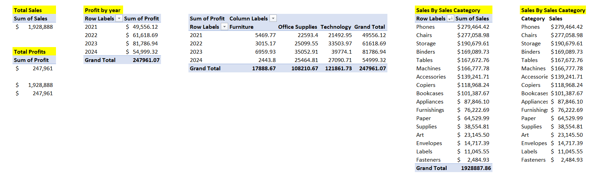
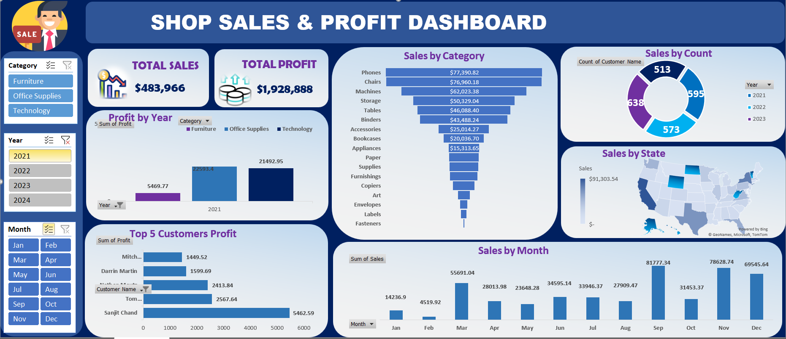
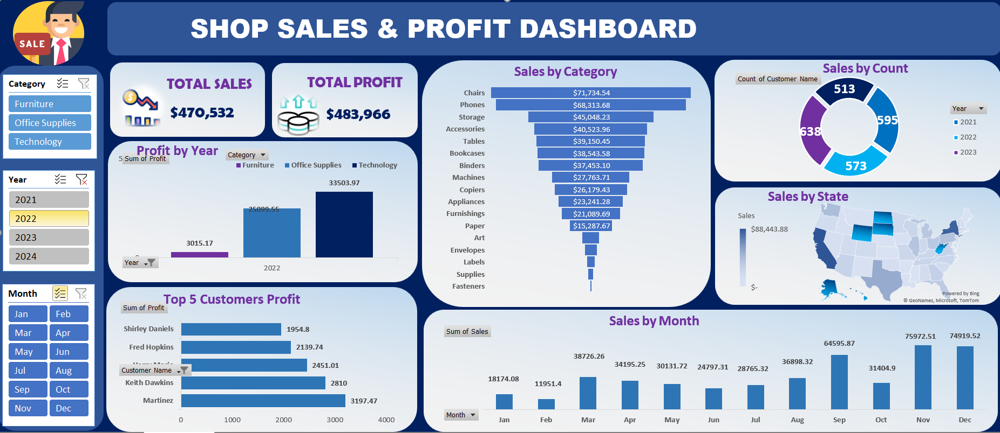
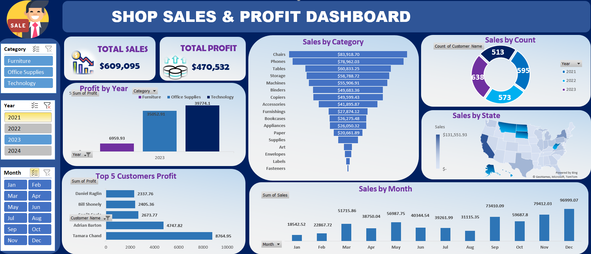
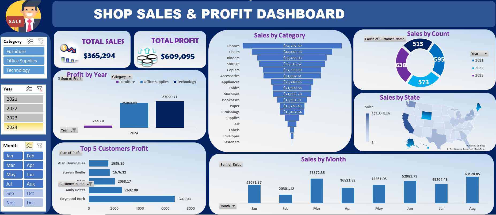

# SALES AND PROFIT ANALYSIS

Analysis of a Shop's Sales and Profit Dataset

## 📋 Project Overview
This project involves a comprehensive analysis of sales and profit data to identify trends, high-performing regions, and product opportunities.
The entire workflow from data extraction and cleaning to processing and visualization—was conducted within Microsoft Excel.
The final output is an interactive dashboard that allows stakeholders to filter performance by year, region, and product category, facilitating data-driven decision-making.

## 🎯 Objectives
The primary goals of this analysis were to:
- Evaluate Performance: Assess total sales and profit margins across different time periods.
- Regional Analysis: Identify top-performing geographic locations and those requiring strategic intervention.
- Product Insights: Determine which product sub-categories drive the highest profitability vs. volume.
- Trend Forecasting: Visualize monthly and quarterly growth patterns to aid in inventory planning.
- Time Series Analysis: Perform month-over-month and year-over-year comparisons of sales and profits.

## 🛠 Tools & Techniques Used
Microsoft Excel (2021)
- Power Query for data transformation
- Power Pivot for enhanced data modeling.
- Data Cleaning: Removal of duplicates, handling null values, and standardization of text formats using functions (TRIM, PROPER, Find & Replace).
- Data Modeling: Utilization of Pivot Tables for aggregation and cross-tabulation.
- Formulas: Advanced usage of XLOOKUP, SUMIFS, INDEX-MATCH, and nested IF statements for dynamic calculations.
- Visualization: Interactive Charts (Bar, Column, Pie, Combo charts, BarHeatmaps).
- Slicers, and Timeline filters
- UI/UX: Conditional Formatting to highlight KPIs and outliers.

# Dashboard Visualisation
An interactive dashboards to visualize key metrics and trends, allowing for easy exploration of the data was created in M.S Excel with sclicer and Timeline.

Dashboard          |     KPIs
:----------------------:|:-------------------------:
        | 

2021 Dashboard          |     2022 Dashboard
:----------------------:|:-------------------------:
        | 

2023 Dashboard          |     2024 Dashboard
:----------------------:|:-------------------------:
        | 

### How to Run the Analysis
- Clone or download this repository to your local machine.
- Open the Sales_and_Profit_Analysis.xlsx file in Microsoft Excel. (Available upon request)
- Follow the instructions above to replicate the analysis, modify data inputs, or adjust visualizations.
- Review the insights and use the dashboards to track business performance.

## Conclusion
This project demonstrates proficiency in using Excel for data analysis, highlighting the ability to clean, analyze, and visualize business data to drive decision-making.
By leveraging advanced Excel techniques like pivot tables, dynamic dashboards, and complex formulas, this analysis provides valuable insights into sales and profit performance across multiple dimensions.

Thank You for reading.🙏

 
